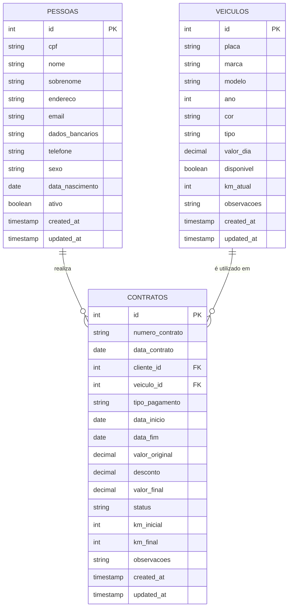
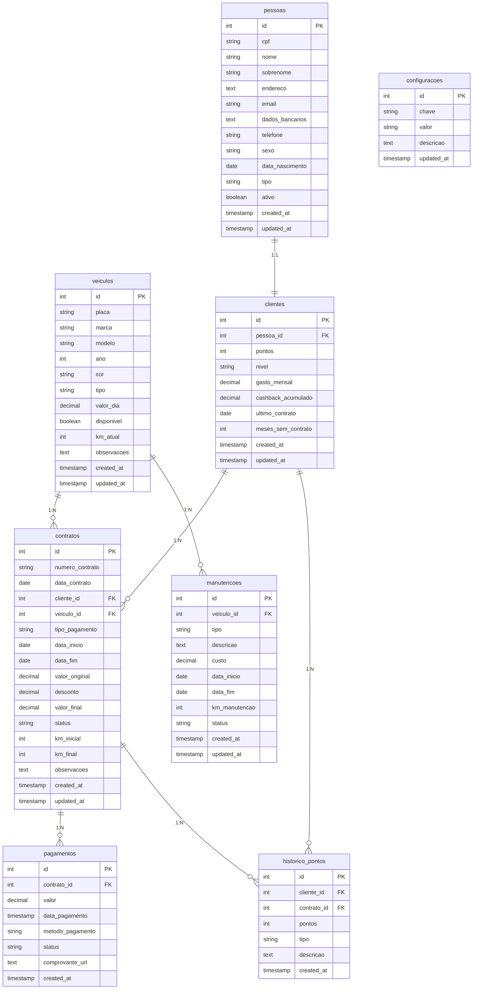

# Projeto-Banco-Aluguel-Carros
Projeto de banco de dados para sistema de aluguel de carros
# Sistema de Aluguel de Carros

## Tema
Engenharia de Dados para Ecossistema de Mobilidade e Locação de Veículos.

O projeto consiste na arquitetura e implementação de um banco de dados relacional robusto, desenvolvido em PostgreSQL. O sistema foi projetado para sustentar uma operação completa de locadora de veículos, integrando a gestão de ativos (frota), o ciclo de vida de contratos de locação, o fluxo financeiro de pagamentos e uma camada inovadora de inteligência de fidelização através de Gamificação.

## Objetivo
O objetivo deste projeto é desenvolver um banco de dados relacional utilizando PostgreSQL para gerenciar de forma eficiente uma empresa de aluguel de veículos. O sistema será responsável por organizar e controlar informações essenciais, como clientes, atendentes, veículos disponíveis e contratos de locação.

A proposta do sistema é atender principalmente motoristas de aplicativos, que necessitam de veículos para trabalhar, oferecendo uma solução prática e organizada para o gerenciamento desses alugueis. Além disso, o sistema também atende pessoas comuns que, por diversos motivos, precisam alugar um carro temporariamente — seja por estarem sem veículo próprio, em viagem ou por conveniência.

Com isso, o sistema permitirá:

O cadastro e gerenciamento de clientes e atendentes
O controle da frota de veículos disponíveis para locação
O registro e acompanhamento de contratos de aluguel
A organização das informações de forma segura, estruturada e escalável

Dessa forma, o projeto busca simular um ambiente real de uma locadora de veículos, aplicando conceitos de modelagem de dados, normalização e boas práticas em banco de dados, além de facilitar futuras integrações com sistemas web ou aplicativos.

## Público-Alvo
O sistema foi desenvolvido para atender:

Locadoras de Veículos Especializadas: Empresas focadas no segmento de B2C (Business to Consumer) que buscam automação no controle de frota e contratos.

Gestores de Frota para Mobilidade Urbana: Operadores que disponibilizam veículos especificamente para motoristas de aplicativos (Uber, 99, InDrive), onde o controle de quilometragem e manutenção preventiva é crítico.

Desenvolvedores e Arquitetos de Software: Profissionais que buscam uma referência de modelagem de dados que inclua regras de negócio complexas, como sistemas de pontos, níveis de recompensa (Loyalty Program) e integridade referencial.

## Tecnologias Utilizadas
- PostgreSQL
- SQL
- GitHub
## Modelo de Dados

## Inovação do Projeto

Inovação: Sistema de Gamificação

O sistema implementa um mecanismo de gamificação para aumentar o engajamento dos clientes.

Objetivo
Incentivar os usuários a alugarem mais veículos através de recompensas.

Funcionalidades implementadas:
- Sistema de pontos por aluguel
- Níveis de cliente (bronze, prata, ouro, diamante)
- Histórico de pontuação
- Cashback baseado no nível
- Evolução automática de nível

Benefícios:
- Maior fidelização de clientes
- Incentivo ao uso contínuo do sistema
- Experiência mais interativa

## Modelo de Dados (ER Diagram)

## Protótipo da Interface

O protótipo da interface do sistema foi gerado utilizando IA para criação de interfaces modernas.

Telas implementadas:

- Login
- Dashboard (tela principal)
- Gerenciamento de pessoas
- Gerenciamento de veículos
- Gerenciamento de Contratos
- Ranking de Clientes (Gamificação)

As imagens das telas podem ser encontradas na pasta:

interface/
