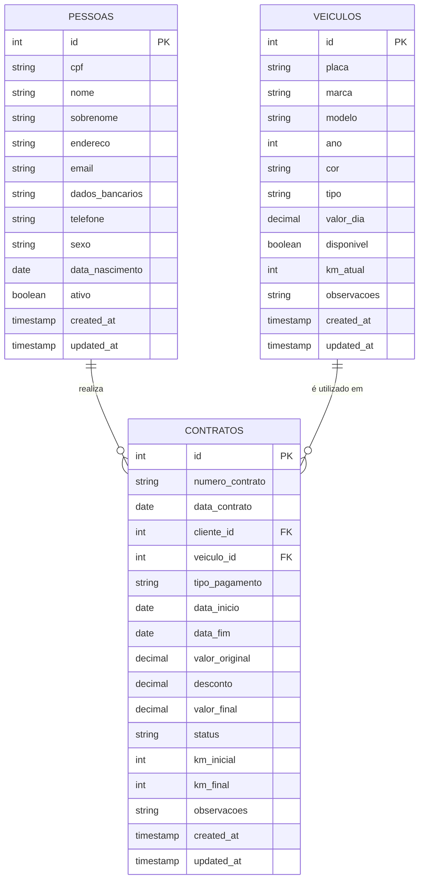
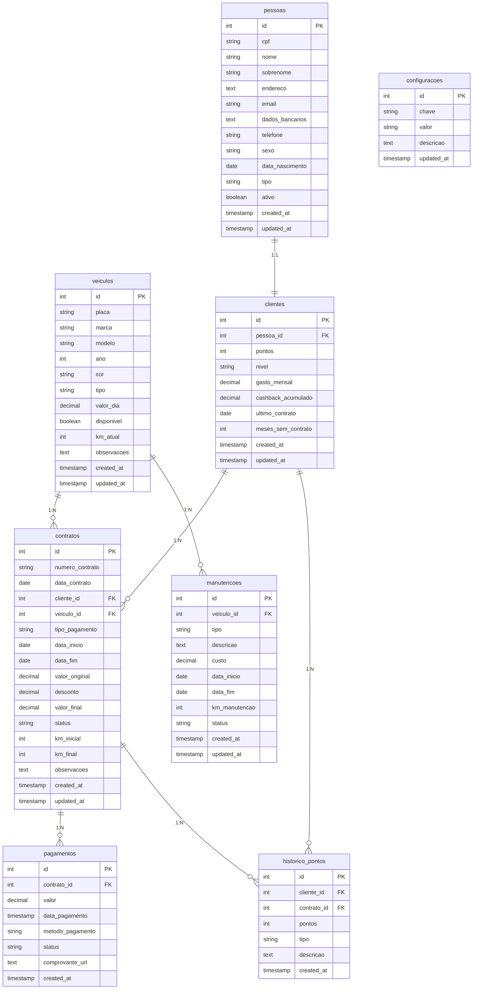

# Projeto-Banco-Aluguel-Carros
Projeto de banco de dados para sistema de aluguel de carros
# Sistema de Aluguel de Carros

## Tema
Sistema de banco de dados para uma empresa de aluguel de carros.

## Objetivo
Desenvolver um banco de dados relacional utilizando PostgreSQL para gerenciar clientes, atendentes, veículos e contratos de aluguel.

O sistema permitirá controlar os veículos disponíveis, registrar clientes e gerenciar os contratos de locação.

## Público-Alvo
Empresas de aluguel de veículos que oferecem carros para motoristas de aplicativos como Uber, 99 e InDrive.

## Tecnologias Utilizadas
- PostgreSQL
- SQL
- GitHub
## Modelo de Dados

## Inovação do Projeto

Inovação: Sistema de Gamificação

O sistema implementa um mecanismo de gamificação para aumentar o engajamento dos clientes.

Objetivo
Incentivar os usuários a alugarem mais veículos através de recompensas.

Funcionalidades implementadas:
- Sistema de pontos por aluguel
- Níveis de cliente (bronze, prata, ouro, diamante)
- Histórico de pontuação
- Cashback baseado no nível
- Evolução automática de nível

Benefícios:
- Maior fidelização de clientes
- Incentivo ao uso contínuo do sistema
- Experiência mais interativa

## Modelo de Dados (ER Diagram)

## Protótipo da Interface

O protótipo da interface do sistema foi gerado utilizando IA para criação de interfaces modernas.

Telas implementadas:

- Login
- Dashboard (tela principal)
- Gerenciamento de pessoas
- Gerenciamento de veículos
- Gerenciamento de Contratos
- Ranking de Clientes (Gamificação)

As imagens das telas podem ser encontradas na pasta:

interface/
