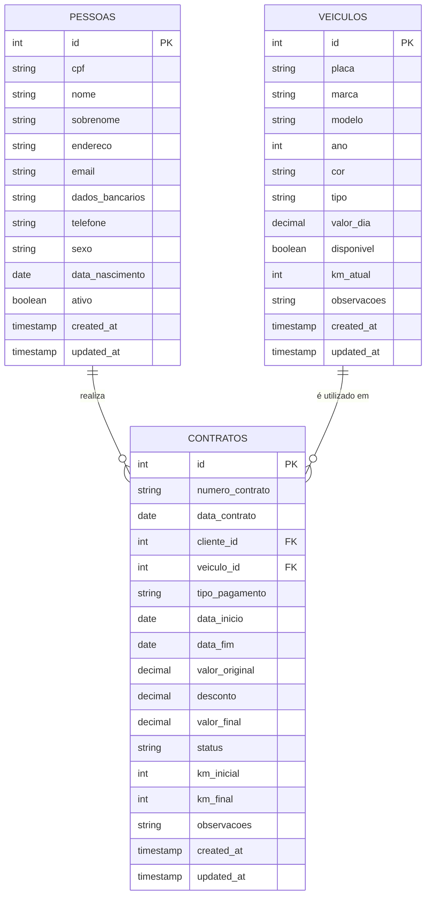
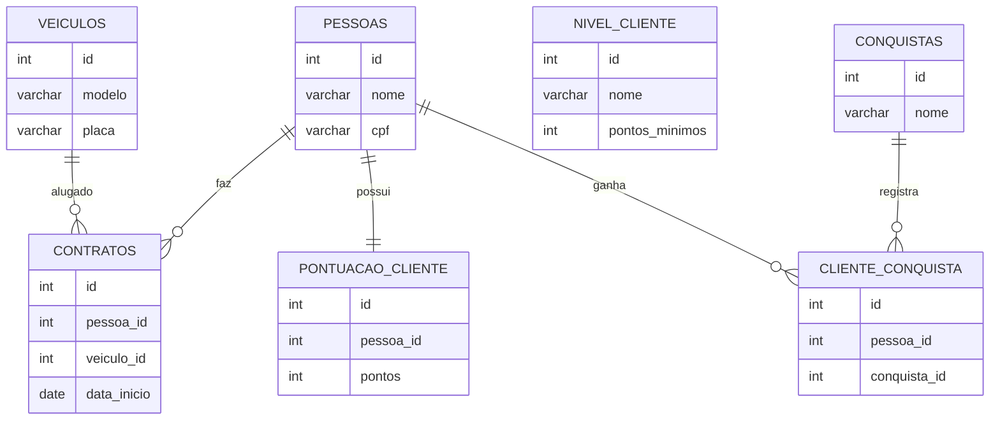

# Projeto-Banco-Aluguel-Carros
Projeto de banco de dados para sistema de aluguel de carros
# Sistema de Aluguel de Carros

## Tema
Sistema de banco de dados para uma empresa de aluguel de carros.

## Objetivo
Desenvolver um banco de dados relacional utilizando PostgreSQL para gerenciar clientes, atendentes, veículos e contratos de aluguel.

O sistema permitirá controlar os veículos disponíveis, registrar clientes e gerenciar os contratos de locação.

## Público-Alvo
Empresas de aluguel de veículos que oferecem carros para motoristas de aplicativos como Uber, 99 e InDrive.

## Tecnologias Utilizadas
- PostgreSQL
- SQL
- GitHub
## Modelo de Dados

## Inovação do Projeto

Para tornar o sistema mais atrativo, foi implementado um sistema de **gamificação**.

A ideia é incentivar os clientes a utilizarem mais o sistema de aluguel de veículos através de recompensas virtuais.

### Funcionalidades de Gamificação

- Sistema de **pontuação** para cada aluguel realizado
- **Níveis de cliente** baseados na quantidade de pontos
- **Conquistas** liberadas conforme o cliente utiliza o sistema
- Possibilidade de criar **ranking de clientes**

### Exemplo

- Ao realizar um aluguel, o cliente ganha pontos
- Ao acumular pontos suficientes, o cliente sobe de nível
- Após certo número de alugueis, o cliente desbloqueia conquistas

## Modelo de Dados (ER Diagram)

## Protótipo da Interface

O protótipo da interface do sistema foi gerado utilizando IA para criação de interfaces modernas.

Telas implementadas:

- Login
- Dashboard (tela principal)
- Gerenciamento de pessoas
- Gerenciamento de veículos
- Gerenciamento de Contratos
- Ranking de Clientes (Gamificação)

As imagens das telas podem ser encontradas na pasta:

interface/
